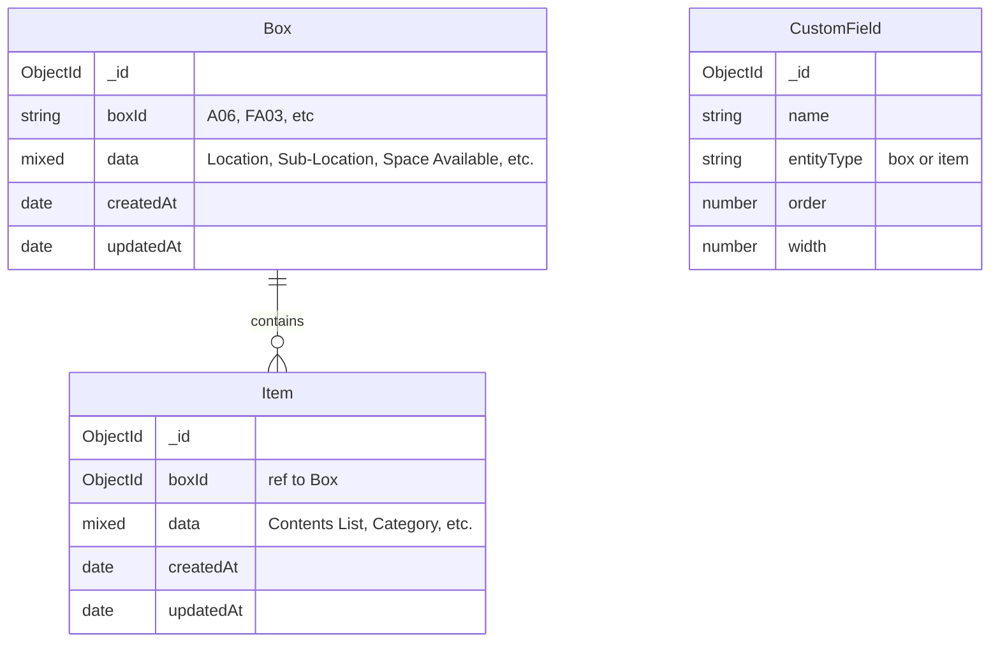

# Box/Location Database Architecture Plan

## Problem Statement

The current database uses a flat, denormalized structure where every item row repeats box-level information (Box ID, Location, Sub-Location, Space Available). This leads to:
- Data redundancy (same box info stored 10+ times per box)
- Inability to query or manage boxes independently
- No way to track box-level metrics (total items, space remaining, etc.)

## Current Data Structure

### Existing Columns (from `output.xlsx`)
| Column | Type | Example Values |
|--------|------|----------------|
| Box ID | **Box-Level** | A01, A06, FA03, P01, "" |
| Location | **Box-Level** | Garage, Theater, Office, Checked Out |
| Sub-Location / Shelf Number | **Box-Level** | Shelf 43, Rear Right, Front Left |
| Summary / Category | **Item-Level (mostly)** | Paint, Mech, Audio, Woodworking |
| Contents List | **Item-Level** | "Qt Poly OB SG Apr 2025", "XLR Cables" |
| Space Available? | **Box-Level** | Y, N, YY, "" |
| Recorded in Partkeepr? | **Box-Level** | Y, N, y, "" |

### Current Models
- [`Item`](backend/models/Item.js) - Stores all data in a flat `data` object (Mixed type)
- [`CustomField`](backend/models/CustomField.js) - Defines column names, order, and width

## Proposed Architecture

### Entity Relationship Diagram



### Field Classification

Based on analysis of the data, here is how columns map to entities:

#### Box-Level Fields (stored on Box model)
- `Box ID` - Unique identifier for the box/location
- `Location` - Room or area (Garage, Theater, Office, etc.)
- `Sub-Location / Shelf Number` - Specific shelf or position
- `Space Available?` - Capacity status of the box

#### Item-Level Fields (stored on Item model)
- `Summary / Category` - Type of items in this entry
- `Contents List` - The actual item description
- `Recorded in Partkeepr?` - Could go either way; keeping with items as it may vary per item

## Implementation Plan

### Phase 1: Backend - New Models and API

#### 1.1 Create Box Model
**File:** `backend/models/Box.js`
```javascript
const boxSchema = new mongoose.Schema({
  // Human-readable box identifier (e.g., "A06", "FA03")
  boxId: {
    type: String,
    trim: true,
    index: true
  },
  // Box-specific data stored dynamically by CustomField name
  data: {
    type: mongoose.Schema.Types.Mixed,
    default: {}
  },
  createdAt: { type: Date, default: Date.now },
  updatedAt: { type: Date, default: Date.now }
});

// Unique index on boxId (allow empty for "no box" items)
boxSchema.index({ boxId: 1 }, { sparse: true });
```

#### 1.2 Update Item Model
**File:** `backend/models/Item.js`
- Add `boxId` field referencing the Box model
- Keep existing `data` structure for item-level fields

```javascript
const itemSchema = new mongoose.Schema({
  boxId: {
    type: mongoose.Schema.Types.ObjectId,
    ref: 'Box',
    default: null
  },
  data: {
    type: mongoose.Schema.Types.Mixed,
    default: {}
  },
  createdAt: { type: Date, default: Date.now },
  updatedAt: { type: Date, default: Date.now }
});

itemSchema.index({ boxId: 1 });
```

#### 1.3 Update CustomField Model
**File:** `backend/models/CustomField.js`
- Add `entityType` field to distinguish Box fields from Item fields

```javascript
const customFieldSchema = new mongoose.Schema({
  name: { type: String, required: true, trim: true, unique: true },
  entityType: {
    type: String,
    enum: ['box', 'item'],
    default: 'item'
  },
  order: { type: Number, default: 0 },
  width: { type: Number, default: 150 }
});
```

#### 1.4 Create Box Controller
**File:** `backend/controllers/boxController.js`
- `createBox` - POST /api/boxes
- `getBoxes` - GET /api/boxes (with optional item count)
- `getBoxById` - GET /api/boxes/:id (with populated items)
- `updateBox` - PUT /api/boxes/:id
- `deleteBox` - DELETE /api/boxes/:id (cascade or warn if items exist)

#### 1.5 Create Box Routes
**File:** `backend/routes/boxes.js`
```
POST   /api/boxes          - Create box
GET    /api/boxes           - List all boxes
GET    /api/boxes/:id       - Get box with items
PUT    /api/boxes/:id       - Update box
DELETE /api/boxes/:id       - Delete box
GET    /api/boxes/:id/items - Get items for a specific box
```

#### 1.6 Register Routes in Server
**File:** `backend/server.js`
- Add `app.use('/api/boxes', require('./routes/boxes'));`

### Phase 2: Data Migration and Import Logic

#### 2.1 Update Import Logic
**File:** `backend/routes/items.js` (import endpoint)
- During import, detect box-level columns
- Create or merge Box documents based on unique combinations of box fields
- Link imported items to their corresponding Box via `boxId`
- Classify CustomFields as `entityType: 'box'` or `entityType: 'item'`

#### 2.2 Migration Script
**File:** `backend/scripts/migrate-to-boxes.js`
- Read existing Item documents
- Group items by box-level field values (Box ID + Location + Sub-Location)
- Create Box documents for each unique group
- Update Items to reference the new Box and remove box-level fields from their `data`
- Update CustomField `entityType` based on field classification

### Phase 3: Frontend Updates

#### 3.1 Box List Page
**File:** `frontend/src/pages/BoxListPage.jsx`
- Table view of all boxes with key info (Box ID, Location, Sub-Location, Item Count, Space Available)
- CRUD operations for boxes
- Click on a box to filter items by that box

#### 3.2 Update Item Entry Form
**File:** `frontend/src/components/ItemEntryForm.jsx`
- Add dropdown to select existing Box or create new one
- Show only item-level fields in the form
- Pre-fill box-level info from selected Box

#### 3.3 Update Item List Page
**File:** `frontend/src/pages/ItemListPage.jsx`
- Add box filter dropdown
- Display box info columns (from referenced Box) alongside item data
- Support grouping items by box

#### 3.4 Update Column Editor
**File:** `frontend/src/components/ColumnEditor.jsx`
- Allow marking fields as "Box" or "Item" type
- Separate sections for Box Fields and Item Fields

#### 3.5 Update Navigation
**File:** `frontend/src/App.jsx`
- Add route for `/boxes` page
- Add "Boxes" link to navigation

### Phase 4: Enhanced Queries

#### 4.1 Items with Box Population
Update item list endpoint to optionally populate box data:
```javascript
// GET /api/items?populateBox=true
const items = await Item.find().populate('boxId', 'boxId data');
```

#### 4.2 Filter by Box
```javascript
// GET /api/items?boxId=xxx
const items = await Item.find({ boxId: req.query.boxId });
```

#### 4.3 Box with Item Count
```javascript
// GET /api/boxes - include item count
const boxes = await Box.aggregate([
  { $lookup: { from: 'items', localField: '_id', foreignField: 'boxId', as: 'items' } },
  { $addFields: { itemCount: { $size: '$items' } } }
]);
```

## Data Migration Strategy

### Known Box-Level Fields (from current data)
These fields should be moved from Item.data to Box.data during migration:
1. `Box ID`
2. `Location`
3. `Sub-Location / Shelf Number`
4. `Space Available?`

### Items Without a Box
Some rows in the data have an empty "Box ID" but still have Location info. These should:
- Get a generated box identifier if Location + Sub-Location are unique
- Or remain unlinked (`boxId: null`) if they truly represent standalone items

## Backward Compatibility

- Existing API endpoints continue to work
- Item export will merge box data back into item rows for flat CSV/Excel output
- Import logic handles both old-style (flat) and new-style (with boxes) files

## Risks and Considerations

1. **Empty Box IDs**: ~20 rows have no Box ID but do have Location info. These need special handling during migration.
2. **"Recorded in Partkeepr?" field**: Currently varies per row within the same box in some cases. Needs review to determine if it should be box-level or item-level.
3. **Space Available values**: Values like "YY" appear, which may indicate a data entry issue. The migration should preserve these as-is.
