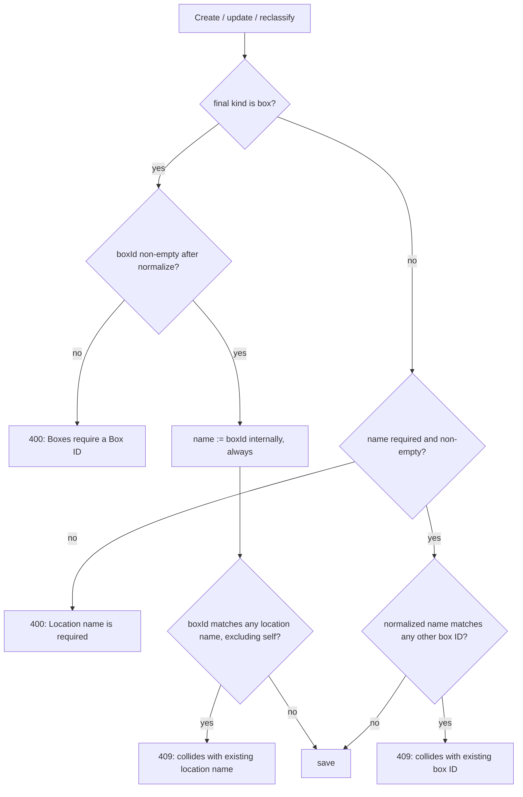

# Container Box/Location Identity Rework

Subtask of `container-tree-and-attributes-plan.md`. Raised during PR #20 (container quick-create) review.

## Design decisions (agreed with owner, 2026-09-05)

### Rules per kind

| | Location | Box |
|---|---|---|
| `name` (user-facing) | Required, free-form, may duplicate across parents | **Does not exist in UI** — auto-set to boxId internally on every write |
| `boxId` | Not allowed (already enforced by backend) | **Required**, unique per database (case-insensitive; partial index already exists), must not match any location name |

### Rationale

- Boxes are movable, so their identity must be position-independent: the physical label (`boxId`) is that stable key. It survives moves/renames and is the import-dedup key.
- A free-text box `name` is uncorrelated data with no maintenance trigger — it drifts out of sync with contents and misleads. The box's identity is its ID; contents (and later structured attributes/tags like "full", size) are the only other meaningful data on a box.
- Internally `name` stays populated for boxes (`name = boxId`, always, not just when blank) because display paths in `computeDisplayPath()` key off it and search/export depend on uniform storage. It is pure plumbing — never rendered as an editable or distinct value to the user.

### Cross-uniqueness (collision rule)

Within a database, **the set of location names and the set of box IDs must be disjoint** (case-insensitive, trimmed). This is one symmetric constraint:
- A location name may not equal any existing box ID.
- A box ID may not equal any existing location name.
- Two locations may still share a name (unchanged).

Why it matters: exported CSV shows one Container column = display path; a box renders `Garage / A06` and a location named "A06" under Garage renders identically — re-import of hand-edited/legacy files can't disambiguate by kind. Human reading + search are also ambiguous (only the ▣ badge distinguishes).

Enforcement:
- Application-level check (cross-document constraints can't be MongoDB indexes): one helper `assertNoNameBoxIdCollision(databaseId, kind, name?, boxId?, excludeId?)` called from create/update/reclassify in `containerController.js`, plus a pre-save hook as defense-in-depth. One query per write against ~134 containers — trivial cost.
- Per-database scoping (consistent with all other uniqueness here).
- Error messages name the offender: `Location name "A06" collides with an existing box ID` / `Box ID "A06" matches an existing location name`.
- Reclassification (location→box, box→location) runs through the same helper on final computed values.

### Existing data risk

Boxes keep their physical IDs (written on the box), so any pre-existing collision means a *location* gets renamed — owner decides; detect-and-report first, no silent renames.

## Write-path flow

## Todo list

- [x] Prerequisite: owner merges PR #19 (Stage 6) and PR #20 (container quick-create) into master — done 2026-09-05, master at `ccd679d` (PR #20 needed a conflict resolution in ItemDialog.jsx after the Stage 6 merge; both sides' code kept)
- [x] Create branch `container-box-identity` from updated master
- [x] Probe real data for existing location-name vs boxId collisions — **result: 0 collisions, 0 ID-less boxes** (Fritz Household Items: 134 containers = 95 box + 39 locations; only duplicate is "FRONT RIGHT" x2 as location names, which is allowed). No migration needed.
- [x] Backend: `findNameBoxIdCollision` helper in containerController.js + boxId-required-for-boxes validation in create/update (final-state check covers reclassification) and Container pre-save hook; auto-set name=boxId on every box write
- [~] Backend startup migration for ID-less boxes — **dropped**: probe found zero ID-less boxes, and all write paths now require a boxId so the state is unreachable. Documented instead.
- [x] Frontend: `ContainerFormDialog` — kind=box shows only Box ID (required) + parent; kind=location shows Name (required) + parent; client-side validation mirrors backend
- [x] Frontend: `ContainerQuickCreateDialog` — same field swap for kind=box
- [x] Frontend: remove BOXID suffix rendering in ItemDialog, ItemListPage, ContainerListPage; drop redundant Box ID column from container list table
- [x] Document revised box/location identity rules + collision rule (and no-migration finding) in `container-tree-and-attributes-plan.md` (decision D7) and this file
- [x] Verify on spare ports against real data: **18/18 API checks passed** (400s for missing/duplicate IDs, 409 collisions both directions case-insensitive, reclassify loc→box and box→loc with name auto-follow, name ignored on boxes); browser end-to-end verified (create dialog field swap, collision error in-dialog, rename/move dialog, reclassification via UI, table renders without Box ID column or duplicated suffixes); before/after counts identical (134 containers / 574 items) — zero data mutation; all 95 real boxes already satisfy name===boxId so display is unchanged for existing data; spare processes cleaned up
- [ ] Commit and push as a PR for owner review

## Implementation notes

- Import paths in `backend/routes/items.js` (JSON snapshot import + CSV/XLSX path builder) now force `name = boxId` when creating box containers, so old snapshots with stale box names can't break the invariant.
- Sibling-name duplicate warnings are locations-only now (boxes are identified by their unique ID).
- Cross-kind collision errors use HTTP 409; missing/invalid identity fields use 400.
