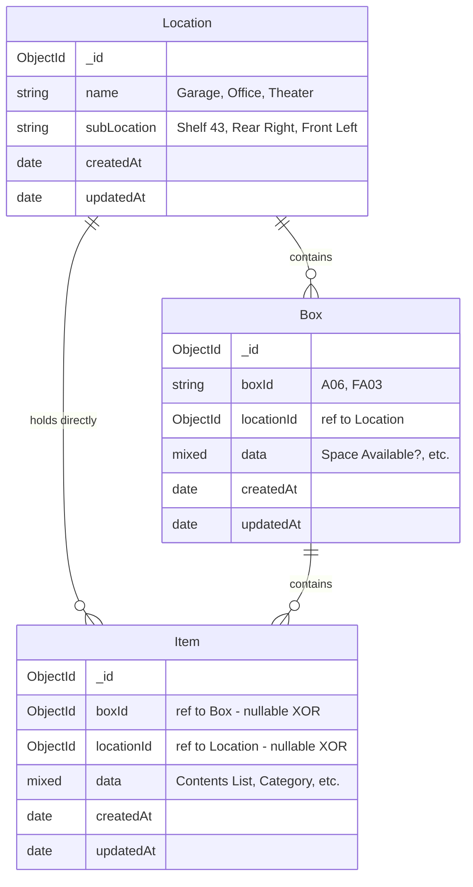
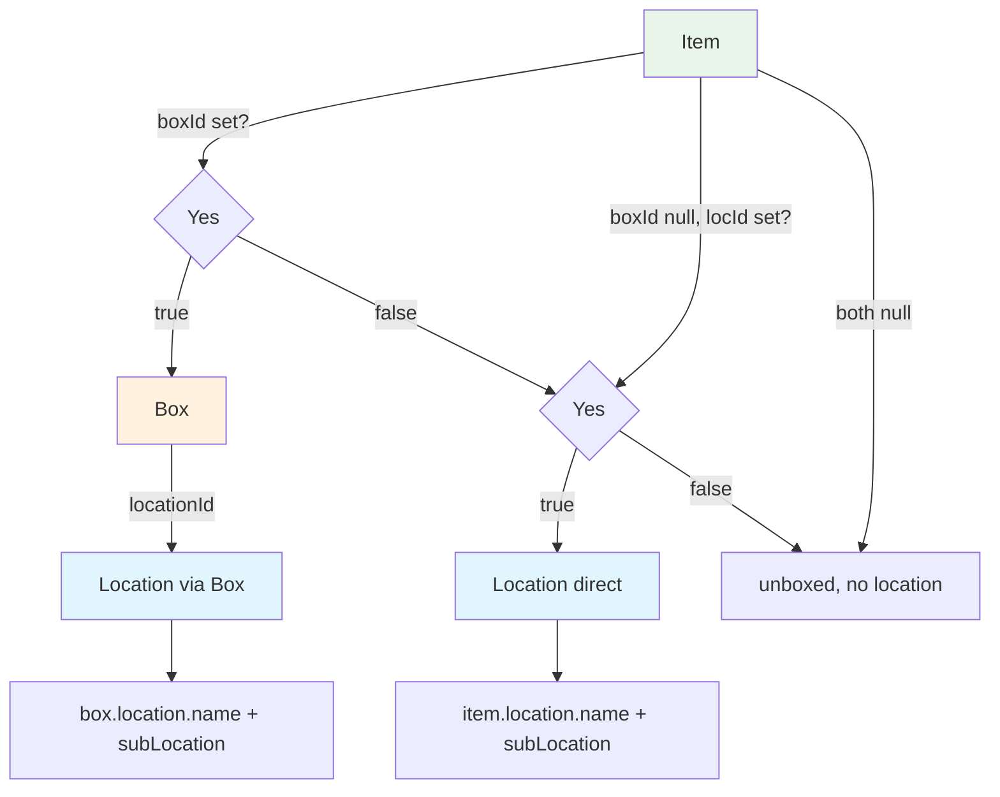

# Location Entity Redesign — Composite (Name + Sub-Location) with XOR Item Reference

## Problem Statement

Currently, location information ("Garage", "Shelf 43") is stored as free-text custom fields in `box.data`. This leads to:
- Duplicate data across boxes in the same location
- No defined list of locations to select from
- Typos and inconsistent naming ("Garaage" vs "Garage")
- The existing Location entity (`backend/models/Location.js`) is underutilized
- Items not in boxes have no way to track their physical location

## New Design

### Entity Relationship Diagram



### Uniqueness Model

A Location is uniquely identified by the **composite** of `name` + `subLocation`:

| name | subLocation | Display Label |
|------|-------------|---------------|
| Garage | Shelf 43 | "Garage — Shelf 43" |
| Garage | Rear Right | "Garage — Rear Right" |
| Office | (empty) | "Office" |
| Theater | (empty) | "Theater" |

Multiple locations can share the same `name` as long as `subLocation` differs. A location with an empty subLocation represents a general area without shelf specificity.

### XOR Reference Rule on Item

An item references **exactly one** of:
- `boxId` — the item is inside a physical box (location inherited from that box)
- `locationId` — the item sits directly at a location with no box
- neither — the item has no assigned location yet

**Both cannot be set simultaneously.** This is enforced via backend validation.

### Resolution Chain for Display



| Scenario | `item.boxId` | `item.locationId` | Display Source |
|----------|-------------|-------------------|----------------|
| Item in a box | Set | **null** | `box.locationId → location.name + subLocation` |
| Item at a location (no box) | **null** | Set | Direct: `location.name + subLocation` |
| Item unassigned | **null** | **null** | "(unboxed, no location)" |

### Form Behavior on ItemEntryForm

- **Box selected** → `boxId` set, `locationId` cleared. Location shown as read-only from the box's location.
- **No box + Location selected** → `locationId` set, `boxId` cleared. Location is editable via dropdown.
- **Neither selected** → Item has no location assignment.

### What Happens to Custom Fields

| Custom Field | Action |
|--------------|--------|
| "Location" | **Disabled** after migration — replaced by Location entity reference |
| "Sub-Location / Shelf Number" | **Disabled** after migration — replaced by Location.subLocation |
| "Box ID" | Kept as `entityType='box'` |
| "Space Available?" | Kept as `entityType='box'` |

---

## Implementation Plan

### Phase 1: Backend — Update Models

#### 1.1 Add subLocation field to Location model

**File:** [`backend/models/Location.js`](backend/models/Location.js:3)

```javascript
const locationSchema = new mongoose.Schema({
  name: {
    type: String,
    required: true,
    trim: true
    // Remove unique: true from here
  },
  subLocation: {
    type: String,
    default: '',
    trim: true
  },
  data: {
    type: mongoose.Schema.Types.Mixed,
    default: {}
  },
  createdAt: { type: Date, default: Date.now },
  updatedAt: { type: Date, default: Date.now }
});

// Composite unique index on (name, subLocation)
locationSchema.index({ name: 1, subLocation: 1 }, { unique: true });

// Virtual for display label
locationSchema.virtual('displayLabel').get(function() {
  return this.subLocation ? `${this.name} — ${this.subLocation}` : this.name;
});
```

#### 1.2 Add locationId to Item model with XOR validation

**File:** [`backend/models/Item.js`](backend/models/Item.js:1)

Add `locationId` field and enforce that it cannot coexist with `boxId`:

```javascript
const itemSchema = new mongoose.Schema({
  boxId: {
    type: mongoose.Schema.Types.ObjectId,
    ref: 'Box',
    default: null
  },
  locationId: {
    type: mongoose.Schema.Types.ObjectId,
    ref: 'Location',
    default: null
  },
  tags: [{ type: mongoose.Schema.Types.ObjectId, ref: 'Tag' }],
  data: { type: mongoose.Schema.Types.Mixed, default: {} },
  createdAt: { type: Date, default: Date.now },
  updatedAt: { type: Date, default: Date.now }
});

itemSchema.index({ boxId: 1 });
itemSchema.index({ locationId: 1 });

// XOR validation: cannot have both boxId and locationId
itemSchema.pre('save', function(next) {
  if (this.boxId && this.locationId) {
    next(new Error('Item can reference a Box or a Location, but not both.'));
  } else {
    next();
  }
});

// Update timestamp
itemSchema.pre('save', function(next) {
  this.updatedAt = Date.now();
  next();
});
```

#### 1.3 Update Location controller

**File:** [`backend/controllers/locationController.js`](backend/controllers/locationController.js:7)

- `createLocation`: Accept `subLocation` in request body
- `updateLocation`: Allow updating `subLocation`, check composite uniqueness
- `getLocationById`: Include subLocation in response, also count direct items (`Item.find({ locationId })`) plus indirect items through boxes
- Display label: Use virtual or compute as `name + (subLocation ? ' — ' + subLocation : '')`

#### 1.4 Update Box model

**File:** [`backend/models/Box.js`](backend/models/Box.js:5)

The `locationId` field already exists. No schema changes needed, but ensure the reference is properly populated in queries.

### Phase 2: Data Migration

#### 2.1 Create migration script

**File:** `backend/scripts/migrate-locations.js`

Steps:
1. Read all existing boxes and extract unique `(Location, Sub-Location / Shelf Number)` pairs from `box.data`
2. For each unique pair, create a Location document with `name` and `subLocation`
3. Update each Box to set `locationId` referencing the new Location document
4. **For items without a box:** Extract `(data.Location, data["Sub-Location / Shelf Number"])` and set `item.locationId` directly
5. Clean up old free-text location data from item.data for unboxed items
6. Disable the "Location" and "Sub-Location / Shelf Number" CustomField entries

```javascript
const Box = require('../models/Box');
const Item = require('../models/Item');
const Location = require('../models/Location');
const CustomField = require('../models/CustomField');

async function migrate() {
  const locationMap = new Map(); // "Garage|Shelf 43" -> Location._id
  
  // Helper: get or create a Location entity
  const getOrCreateLocation = async (name, subLoc) => {
    if (!name) return null;
    const key = `${name}|${subLoc}`;
    if (!locationMap.has(key)) {
      let location = await Location.findOne({ name, subLocation: subLoc });
      if (!location) {
        location = await Location.create({ name, subLocation: subLoc || '' });
      }
      locationMap.set(key, location._id);
    }
    return locationMap.get(key);
  };
  
  // Step 1-3: Migrate boxes to Location entities
  const boxes = await Box.find();
  for (const box of boxes) {
    const locName = box.data?.Location || '';
    const subLoc = box.data?.['Sub-Location / Shelf Number'] || '';
    if (locName) {
      box.locationId = await getOrCreateLocation(locName, subLoc);
      await box.save();
    }
  }
  
  // Step 4-5: Migrate unboxed items to direct Location references
  const unboxedItems = await Item.find({ boxId: null });
  for (const item of unboxedItems) {
    const locName = item.data?.Location || '';
    const subLoc = item.data?.['Sub-Location / Shelf Number'] || '';
    if (locName) {
      item.locationId = await getOrCreateLocation(locName, subLoc);
      delete item.data.Location;
      delete item.data['Sub-Location / Shelf Number'];
      await item.save();
    }
  }
  
  // Step 6: Disable the old custom fields
  await CustomField.updateMany(
    { name: { $in: ['Location', 'Sub-Location / Shelf Number'] } },
    { disabled: true }
  );
  
  console.log(`Migrated ${locationMap.size} unique locations.`);
}

migrate().catch(console.error);
```

### Phase 3: Backend — Update Resolution Logic

#### 3.1 Update item exports (CSV/XLSX)

**File:** [`backend/controllers/itemController.js`](backend/controllers/itemController.js:222)

In `exportCsv` and `exportXlsx`, resolve location through the entity reference chain:

```javascript
// Populate both boxId (with its locationId) and direct item.locationId
const items = await Item.find()
  .populate({
    path: 'boxId',
    populate: { path: 'locationId', select: 'name subLocation' }
  })
  .populate('locationId', 'name subLocation');

// Helper to get display value for any item
const getLocationDisplay = (item) => {
  // Via box
  const locViaBox = item.boxId?.locationId;
  if (locViaBox) return locViaBox.subLocation 
    ? `${locViaBox.name} — ${locViaBox.subLocation}` : locViaBox.name;
  // Direct location reference
  const directLoc = item.locationId;
  if (directLoc) return directLoc.subLocation 
    ? `${directLoc.name} — ${directLoc.subLocation}` : directLoc.name;
  return '';
};
```

#### 3.2 Update itemController updateItem for XOR enforcement

**File:** [`backend/controllers/itemController.js`](backend/controllers/itemController.js:113)

In `updateItem`, handle the XOR logic when boxId or locationId changes:

```javascript
// If setting a box, clear direct location reference
if (boxId !== undefined && (boxId || null)) {
  item.locationId = null;
}
// If explicitly clearing box and no location provided, both stay null
item.boxId = boxId || null;
```

Also update the preserve-on-detach logic: when detaching from a box, do NOT copy Location/Sub-Location fields (since those are now entity references, not custom field data). The old custom fields will be disabled.

#### 3.3 Update search logic

**File:** [`backend/controllers/itemController.js`](backend/controllers/itemController.js:304)

For searching by location text, use an aggregation pipeline that joins through both reference paths (box→location and direct locationId), or post-filter in the controller after populating.

### Phase 4: Backend — Update Import Logic

**File:** [`backend/routes/items.js`](backend/routes/items.js:28)

- Remove "Location" and "Sub-Location / Shelf Number" from `KNOWN_BOX_FIELDS`
- During import, create or find Location entities based on the mapped location columns
- For items with a box → set `box.locationId`
- For unboxed items → set `item.locationId` directly

### Phase 5: Frontend — Update Location Management

#### 5.1 Update LocationListPage

**File:** [`frontend/src/pages/LocationListPage.jsx`](frontend/src/pages/LocationListPage.jsx:33)

- Add `subLocation` column to the table
- Display label as `"name — subLocation"` (or just name if empty)
- Show both box count and direct item count
- Allow filtering/searching by both fields

#### 5.2 Update LocationEntryPage

**File:** [`frontend/src/pages/LocationEntryPage.jsx`](frontend/src/pages/LocationEntryPage.jsx)

- Add `subLocation` input field to the form
- Validate composite uniqueness on save (name + subLocation must be unique together)
- Display label preview: `"Garage — Shelf 43"`

### Phase 6: Frontend — Update Box Management

#### 6.1 Update BoxEntryPage / BoxListPage

**File:** [`frontend/src/pages/BoxListPage.jsx`](frontend/src/pages/BoxListPage.jsx) (and BoxEntryPage if separate)

- Replace free-text "Location" field with a dropdown selecting from Location entities
- Fetch locations via `api.getLocations()`
- Display each as `"Garage — Shelf 43"` format
- Set `locationId` on the Box when saving
- Show resolved location info in box list table

### Phase 7: Frontend — Update Item Display and Forms

#### 7.1 Update ItemListPage

**File:** [`frontend/src/pages/ItemListPage.jsx`](frontend/src/pages/ItemListPage.jsx)

- "Location" and "Sub-Location / Shelf Number" columns are now disabled custom fields (hidden from table by default)
- Add a new "Location" column that resolves through the entity reference chain:
  - If `item.boxId` → resolve `box.locationId → location.displayLabel`
  - If `item.locationId` → resolve directly to `location.displayLabel`
  - If neither → show "(unboxed)" or empty
- Update `getFieldValue` and `getBulkFieldValue` for the new resolution chain
- Update sort and search to work with resolved location display values
- Populate items with both `boxId.locationId` and direct `locationId`

#### 7.2 Update ItemEntryForm

**File:** [`frontend/src/components/ItemEntryForm.jsx`](frontend/src/components/ItemEntryForm.jsx)

- Remove free-text "Location" and "Sub-Location / Shelf Number" fields from the form
- Add a Location dropdown (selecting from Location entities) that is:
  - **Visible and editable** when no box is selected → sets `item.locationId`
  - **Hidden or read-only** when a box IS selected → location inherited from box
- When switching between Box and Location selectors, enforce XOR:
  - Selecting a box clears the location dropdown
  - Selecting a location clears the box selector
- Display inherited location as read-only when box is selected

#### 7.3 Update Bulk Edit Dialog

**File:** [`frontend/src/pages/ItemListPage.jsx`](frontend/src/pages/ItemListPage.jsx:1312)

- Remove "Location" and "Sub-Location / Shelf Number" from bulk edit fields (they are disabled custom fields)
- Keep box assignment dropdown which controls location indirectly for boxed items
- For unboxed items, allow setting a direct Location reference in bulk edit

### Phase 8: Frontend — Update Column Editor

**File:** [`frontend/src/components/ColumnEditor.jsx`](frontend/src/components/ColumnEditor.jsx)

- "Location" and "Sub-Location / Shelf Number" will appear as disabled (hidden from tables)
- No new entityType needed — the enum stays `['box', 'item']`

---

## Files to Modify Summary

| File | Change |
|------|--------|
| [`backend/models/Location.js`](backend/models/Location.js:3) | Add `subLocation`, composite unique index, displayLabel virtual |
| [`backend/models/Item.js`](backend/models/Item.js:1) | Add `locationId` field with XOR validation against `boxId` |
| [`backend/controllers/locationController.js`](backend/controllers/locationController.js:7) | Handle `subLocation` in CRUD, count direct items |
| [`backend/controllers/itemController.js`](backend/controllers/itemController.js:113) | XOR enforcement on update, resolve location via entity refs in exports |
| [`backend/routes/items.js`](backend/routes/items.js:28) | Import creates Location entities, not free-text fields |
| `backend/scripts/migrate-locations.js` | **New** — Migrate existing data to Location entities |
| [`frontend/src/pages/LocationListPage.jsx`](frontend/src/pages/LocationListPage.jsx:33) | Show/edit subLocation column, direct item count |
| [`frontend/src/pages/LocationEntryPage.jsx`](frontend/src/pages/LocationEntryPage.jsx) | Add subLocation input field |
| [`frontend/src/pages/BoxListPage.jsx`](frontend/src/pages/BoxListPage.jsx) | Location dropdown with composite display label |
| [`frontend/src/pages/ItemListPage.jsx`](frontend/src/pages/ItemListPage.jsx:327) | Resolve location via box.locationId or item.locationId chain |
| [`frontend/src/components/ItemEntryForm.jsx`](frontend/src/components/ItemEntryForm.jsx:56) | Box OR Location selector with XOR behavior |

## Migration Risks and Rollback

- **Risk:** Existing Location documents may have names that conflict with new composite uniqueness. Mitigation: Check for conflicts during migration and add subLocation to disambiguate.
- **Rollback:** The old custom field data remains in `box.data` until explicitly cleaned. Keep the disabled CustomField entries so they can be re-enabled if needed.
