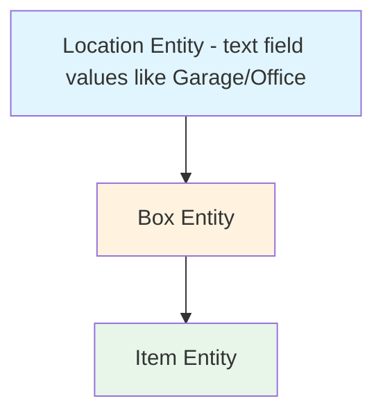

# Location Entity Type Redesign Plan

## Overview

Introduce a third entity type `"location"` alongside `"box"` and `"item"` in the CustomField model. This allows fields like "Location" (Garage, Office) and "Sub-Location / Shelf Number" to be conceptually classified as belonging above boxes, while maintaining backward compatibility with the existing resolution chain.

## Key Concept: Resolution Chain for Display

For fields with `entityType='location'`:

1. **If item has a Box** -> show `box.data[fieldName]` (inherited from box) — **NOT EDITABLE** on item form
2. **If item has no Box** -> show `item.data[fieldName]` (direct value) — **EDITABLE** on item form

This is the same resolution pattern as current `"box"` type fields, but semantically distinct: location fields represent physical placement information that conceptually belongs above boxes in the hierarchy.

## Hierarchy Visualization



**Entity Type Classification:**
- `entityType='location'` — Physical placement fields (Location, Sub-Location / Shelf Number). Stored on Box, inherited by Items. Editable directly on Item when unboxed.
- `entityType='box'` — Box-specific metadata (Box ID, Space Available?). Stored on Box, inherited by Items. Editable directly on Item when unboxed.
- `entityType='item'` — Item-specific data (Contents List, Summary / Category). Stored only on Item.

**Note:** The existing Location model (`backend/models/Location.js`) with `locationId` on Box remains separate and untouched. This plan is about custom field classification, not the Location entity itself. "Location" as a text field value (Garage, Office) is different from the Location entity.

## Changes by Component

### 1. Backend: CustomField Model

**File:** [`backend/models/CustomField.js`](backend/models/CustomField.js:11)

Change the `entityType` enum from `['box', 'item']` to `['box', 'item', 'location']`.

```javascript
entityType: {
  type: String,
  enum: ['box', 'item', 'location'],
  default: 'item'
}
```

### 2. Backend: Item Controller - Preserve-on-Detach Logic

**File:** [`backend/controllers/itemController.js`](backend/controllers/itemController.js:127)

In `updateItem`, the preserve-on-detach / clear-on-attach logic currently only handles `entityType='box'` fields. Extend it to also handle `entityType='location'` fields.

**Current behavior (line 134):**
```javascript
const boxFields = await CustomFieldModel.find({ entityType: 'box', disabled: false });
```

**New behavior:**
```javascript
const inheritedFields = await CustomFieldModel.find(
  { entityType: { $in: ['box', 'location'] }, disabled: false }, 
  {}
);
const inheritedFieldNames = inheritedFields.map(f => f.name);
```

When detaching from a box, preserve both box-level and location-level field values in `item.data`. When attaching to a new box, clear stale overrides for both types.

### 3. Backend: Export Functions (CSV/XLSX)

**File:** [`backend/controllers/itemController.js`](backend/controllers/itemController.js:230)

In `exportCsv` and `exportXlsx`, the export logic currently resolves field values based on `entityType === 'box'`. Extend to also handle `entityType === 'location'`.

**Current (line 233):**
```javascript
if (field.entityType === 'box') {
  row[field.name] = (item.boxId && item.boxId.data && item.boxId.data[field.name]) || '';
} else {
  row[field.name] = (item.data && item.data[field.name]) || '';
}
```

**New:**
```javascript
if (field.entityType === 'box' || field.entityType === 'location') {
  // Item-level override takes precedence, then fall back to box data
  const itemVal = item.data?.[field.name];
  if (itemVal !== undefined && itemVal !== '') {
    row[field.name] = itemVal;
  } else {
    row[field.name] = (item.boxId && item.boxId.data && item.boxId.data[field.name]) || '';
  }
} else {
  row[field.name] = (item.data && item.data[field.name]) || '';
}
```

### 4. Backend: Search Items

**File:** [`backend/controllers/itemController.js`](backend/controllers/itemController.js:304)

The `searchItems` function currently only searches `item.data`. For location-type fields, also search the associated box data when items are boxed. This requires a more complex query or post-filtering approach since MongoDB cannot easily search across populated references in a single query.

**Recommendation:** Keep the current simple search for now (it already searches `item.data` which contains overrides for unboxed items). The basic search in the frontend already handles box data separately. If needed, enhance later with an aggregation pipeline.

### 5. Backend: CustomField Controller - Delete Field

**File:** [`backend/controllers/customFieldController.js`](backend/controllers/customFieldController.js:150)

In `deleteField`, when deleting a location-type field, also clean up the data from Box documents (not just Item documents), since location values are stored on boxes.

**Current behavior:** Only removes field data from Items.
**New behavior:** Also remove from Boxes when `entityType` is `'location'` or `'box'`.

### 6. Frontend: ItemListPage - Field Categorization

**File:** [`frontend/src/pages/ItemListPage.jsx`](frontend/src/pages/ItemListPage.jsx:85)

Introduce a third category of fields:

```javascript
const activeFields = customFields.filter(f => !f.disabled);
const boxFields = activeFields.filter(f => f.entityType === 'box');
const locationFields = activeFields.filter(f => f.entityType === 'location');
const itemFields = activeFields.filter(f => f.entityType === 'item');
```

### 7. Frontend: ItemListPage - getFieldValue / getBulkFieldValue

**File:** [`frontend/src/pages/ItemListPage.jsx`](frontend/src/pages/ItemListPage.jsx:327)

Extend `getFieldValue` to handle location-type fields with the same resolution chain as box fields:

```javascript
const getFieldValue = (item, field) => {
  if (field.entityType === 'box' || field.entityType === 'location') {
    // Item-level override takes precedence over box inheritance
    const itemVal = item.data?.[field.name];
    if (itemVal !== undefined && itemVal !== '') return itemVal;
    // Fall back to box data
    return (item.boxId && item.boxId.data && item.boxId.data[field.name]) || '';
  }
  return (item.data && item.data[field.name]) || '';
};
```

Same pattern applies to `getBulkFieldValue`.

### 8. Frontend: ItemListPage - Table Rendering

**File:** [`frontend/src/pages/ItemListPage.jsx`](frontend/src/pages/ItemListPage.jsx:1044)

Location fields should render in the table alongside box fields (since they share the same inheritance pattern). Two options:

**Option A (Recommended):** Render location fields as a separate group between box fields and item fields. This visually separates "where" from "what box".

**Option B:** Merge location fields into the box field section since they behave identically.

For table headers and body cells, treat `locationFields` the same way as `boxFields`:
- Use `getFieldValue(item, field)` for display
- Show the unboxed override icon when item has no box but has a direct value
- Support sorting with the same resolution chain

### 9. Frontend: ItemListPage - Sort and Search Logic

**File:** [`frontend/src/pages/ItemListPage.jsx`](frontend/src/pages/ItemListPage.jsx:346)

In `getSortedItems`, extend the sort logic to handle location-type fields:

```javascript
if (customField.entityType === 'box' || customField.entityType === 'location') {
  aVal = a.data?.[fieldName] || a.boxId?.data?.[fieldName] || '';
  bVal = b.data?.[fieldName] || b.boxId?.data?.[fieldName] || '';
}
```

In `matchesCriterion` for advanced search, same pattern.

### 10. Frontend: ItemListPage - Column Options for Search

**File:** [`frontend/src/pages/ItemListPage.jsx`](frontend/src/pages/ItemListPage.jsx:407)

Update `columnOptions` to include location fields:

```javascript
const columnOptions = [
  ...boxFields.map(f => ({ id: f._id, label: `${f.name} (Box)` })),
  ...locationFields.map(f => ({ id: f._id, label: `${f.name} (Location)` })),
  ...itemFields.map(f => ({ id: f._id, label: f.name })),
  { id: 'tags', label: 'Tags' },
];
```

### 11. Frontend: ItemListPage - Bulk Edit Dialog

**File:** [`frontend/src/pages/ItemListPage.jsx`](frontend/src/pages/ItemListPage.jsx:514)

Location fields in bulk edit should follow the same conditional behavior as box fields:
- When a new box is assigned in bulk edit, location fields become read-only (inherited from box)
- When no box is assigned, location fields are editable for unboxed items
- The `handleBulkSave` logic needs to handle location-type field updates to both Box documents and Item documents

Update `openBulkEdit` initialization:
```javascript
[...boxFields, ...locationFields, ...itemFields].forEach(field => {
  form[field._id] = getBulkFieldValue(field);
});
```

Update `handleBulkSave`:
- For location fields on boxed items: update the Box document
- For location fields on unboxed items: update the Item document directly

### 12. Frontend: ItemEntryForm - Location Fields Behavior

**File:** [`frontend/src/components/ItemEntryForm.jsx`](frontend/src/components/ItemEntryForm.jsx:56)

Introduce `locationFields` as a separate category:

```javascript
const activeLocationFields = result.data.filter(f => f.entityType === 'location' && !f.disabled);
setLocationFields(activeLocationFields);
```

**When no box selected:** Show location fields as editable TextFields (same as current behavior for box fields).

**When box is selected:** Show location fields as read-only reference (same as current behavior for box fields).

Update the form initialization to include location fields:
```javascript
[...activeItemFields, ...activeBoxFields, ...activeLocationFields].forEach(field => {
  initialData[field.name] = '';
});
```

Update the box selection handler to also clear location field overrides when a box is selected.

Render location fields in a separate section between box fields and item fields:

```jsx
{/* Location-level fields */}
{locationFields.length > 0 && (
  <>
    {!selectedBoxId ? (
      locationFields.map(field => (
        <TextField key={field._id} ... helperText="Set directly on this item (no box assigned)" />
      ))
    ) : (
      <Box sx={{ my: 2, p: 2, bgcolor: '#e1f5fe', borderRadius: 1 }}>
        <Typography variant="caption">Inherited from selected box:</Typography>
        {locationFields.map(field => (
          <Typography key={field._id}><strong>{field.name}:</strong> {val}</Typography>
        ))}
      </Box>
    )}
  </>
)}
```

### 13. Frontend: ColumnEditor - Add Location Entity Type Option

**File:** [`frontend/src/components/ColumnEditor.jsx`](frontend/src/components/ColumnEditor.jsx:180)

Add "Location" as a third option in the entityType dropdown for both creating and editing fields:

```jsx
<MenuItem value="item">Item</MenuItem>
<MenuItem value="box">Box</MenuItem>
<MenuItem value="location">Location</MenuItem>
```

Also update the field grouping display to show a "Location Columns" section between Box and Item sections.

### 14. Backend: Import Logic - Handle Location Fields

**File:** [`backend/routes/items.js`](backend/routes/items.js:28)

The `KNOWN_BOX_FIELDS` array currently includes 'Location' and 'Sub-Location / Shelf Number'. After this redesign, these should be classified as `entityType='location'` during import rather than `entityType='box'`.

Update the import logic to detect location-type fields and set the correct entityType when creating CustomField entries.

## Data Migration Considerations

If existing fields like "Location" and "Sub-Location / Shelf Number" currently have `entityType='box'`, a migration script should update them to `entityType='location'`. This is a simple update:

```javascript
await CustomField.updateMany(
  { name: { $in: ['Location', 'Sub-Location / Shelf Number'] }, entityType: 'box' },
  { entityType: 'location' }
);
```

No data movement is needed since the storage pattern (on Box, inherited by Items) is identical between `entityType='box'` and `entityType='location'`.

## Summary of Files to Modify

| File | Change |
|------|--------|
| [`backend/models/CustomField.js`](backend/models/CustomField.js:11) | Add 'location' to enum |
| [`backend/controllers/itemController.js`](backend/controllers/itemController.js:127) | Handle location fields in preserve-on-detach, exports |
| [`backend/controllers/customFieldController.js`](backend/controllers/customFieldController.js:150) | Clean location data from boxes on delete |
| [`backend/routes/items.js`](backend/routes/items.js:28) | Classify location fields correctly during import |
| [`frontend/src/pages/ItemListPage.jsx`](frontend/src/pages/ItemListPage.jsx:85) | Add locationFields category, update resolution logic |
| [`frontend/src/components/ItemEntryForm.jsx`](frontend/src/components/ItemEntryForm.jsx:56) | Handle location fields with conditional editability |
| [`frontend/src/components/ColumnEditor.jsx`](frontend/src/components/ColumnEditor.jsx:180) | Add 'Location' option to entityType dropdowns |
